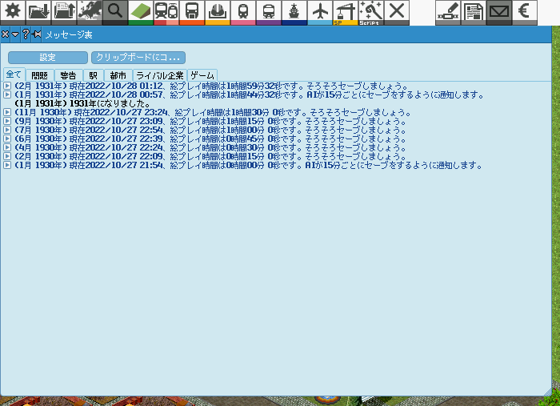

# ゲームプレイ時間通知通知AI

## 概要
指定時間おきにセーブをするようにメッセージ通知をしてくれます。
それ以外は何もしないため、普通に人間が操作する会社として利用できます。

## 使い方

https://github.com/128na/sqai_timer/releases
リリースページからsqai_timer.zipをダウンロード、解凍した `sqai_timer` のフォルダを `Simutrans\ai` フォルダ内にコピーしてください。

Simutransを起動し、会社を `ScriptAI` 属性で作成、スクリプトは `sqai_timer` を指定します。
あとは勝手に通知してくれます。

## 設定

`ai.nut` の設定を変更することで通知間隔を変更できます。

- notify_period
  - 通知周期（分）を指定できます。
  - 通知したくない場合は0を指定します。
- save_notify_period
  - セーブ通知周期（分）を指定できます。
  - 通知したくない場合は0を指定します。
